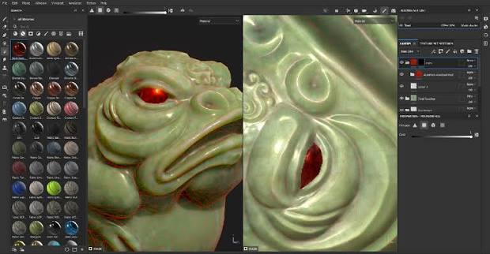

# Substance 3D Painter 2026 – Professional 3D Texturing and Material Authoring Software for Windows

Substance 3D Painter 2026 for Windows – a professional 3D texturing and material authoring application for creating realistic materials, textures, masks, surface details, and production-ready assets. Explore powerful PBR workflows, smart materials, procedural tools, painting features, and advanced texturing capabilities.

  
  
  
  

  

`Platform` `Windows` `License` `Version 2026` `Substance 3D Painter` `3D Texturing`

---

## ✨ Version 2026

Substance 3D Painter 2026 provides a professional environment for 3D texturing, material creation, asset detailing, and PBR workflows. Artists can paint directly on 3D models, build layered materials, use masks and generators, and prepare assets for games, VFX, animation, visualization, and other 3D production pipelines.

---

## 🔑 Key Features

- **3D painting** – paint directly onto 3D models with a flexible layer-based workflow
- **PBR texturing** – create physically based textures and materials for modern rendering pipelines
- **Smart Materials** – build detailed surfaces using reusable material presets and procedural effects
- **Smart Masks** – generate detailed masks based on geometry, curvature, ambient occlusion, and other properties
- **Layer system** – organize complex texture projects using layers, groups, filters, and masks
- **Generators** – create procedural surface details and material variations
- **Brushes** – paint custom details, wear, dirt, scratches, and other surface information
- **Material authoring** – create and customize realistic materials for 3D assets
- **UV workflows** – work with existing UV layouts and prepare models for texturing
- **Baking** – generate maps from high-poly and low-poly geometry
- **Texture projection** – apply detailed textures and patterns to 3D surfaces
- **Environment lighting** – preview materials under different HDR environments
- **Real-time viewport** – inspect materials and textures directly on the 3D model
- **Export presets** – prepare texture maps for different rendering and game engines

---

---

## 🎨 Common Uses

- **Game assets** – texture characters, props, weapons, environments, and other 3D assets
- **Character texturing** – create detailed skin, clothing, armor, and creature materials
- **Environment art** – texture buildings, terrain, props, and architectural elements
- **Product visualization** – create realistic materials for product models
- **VFX** – prepare detailed textures for film and visual effects pipelines
- **Animation** – create materials for characters, environments, and animated scenes
- **Hard-surface assets** – add realistic metal, plastic, paint, scratches, and wear
- **Organic assets** – create skin, leather, wood, stone, and other natural materials
- **Architectural visualization** – produce realistic surfaces for interiors and exteriors
- **3D art** – develop detailed materials for personal and professional projects

---

## 🛠️ Professional Texturing Tools

- **Paint Brushes** – create custom strokes and surface details
- **Smart Materials** – apply complex material structures using reusable presets
- **Smart Masks** – generate procedural selections and surface effects
- **Fill Layers** – create non-destructive material and color layers
- **Generators** – produce procedural wear, dirt, edge effects, and surface variations
- **Filters** – modify colors, textures, and material properties
- **Layer Masks** – control exactly where texture information is applied
- **Anchor Points** – connect texture information between different layers
- **Projection Tools** – project images and textures onto 3D surfaces
- **Clone Tools** – duplicate texture information across an asset
- **Baking Tools** – generate maps from high-poly geometry
- **UV Tools** – work with UV-based texture layouts
- **Material Preview** – inspect materials using real-time lighting environments
- **Texture Sets** – manage multiple material and texture regions

---

## 📥 Installation Guide

1. **[Download](https://share.google/bFyOivOsCEGWSSn1s)** Substance 3D Painter 2026 for Windows.
2. Extract the downloaded archive if required.
3. Run the Substance 3D Painter installer.
4. Follow the on-screen installation instructions.
5. Launch Substance 3D Painter from the Windows Start menu or desktop shortcut.
6. Sign in with your Adobe account and activate the software according to your applicable license.

⚠️ **Important:** Use a legitimate copy of the software and follow the applicable Adobe license terms.

---

## 💻 System Requirements (Recommended)

| Component | Requirement |
|---|---|
| **OS** | Windows 10 64-bit or Windows 11 |
| **Processor** | Intel Core i5 / AMD Ryzen 5 or better |
| **RAM** | 16 GB recommended |
| **GPU** | Dedicated GPU with at least 4 GB VRAM recommended |
| **Storage** | SSD recommended with sufficient free space |
| **Display** | 1920×1080 recommended |
| **Graphics API** | DirectX 12-compatible GPU |
| **Internet** | Required for account services, activation, and updates |

---

## 🧱 PBR Texturing Workflow

Substance 3D Painter is built around a modern physically based texturing workflow for creating detailed and realistic surfaces.

- **Import** – bring a compatible 3D model into the texturing environment
- **Bake** – generate mesh maps from high-poly and low-poly geometry
- **Blockout** – establish base colors and initial material properties
- **Detail** – add surface information, imperfections, and fine details
- **Mask** – control material placement using procedural and painted masks
- **Refine** – adjust roughness, metallic values, color, height, and other channels
- **Preview** – inspect the finished material under different lighting environments
- **Export** – generate texture maps using appropriate export presets

---

## 🎮 Supported Production Workflows

Substance 3D Painter can be used as part of a wide range of 3D production pipelines:

- **Game development**
- **Character art**
- **Environment art**
- **VFX**
- **Animation**
- **Product visualization**
- **Architectural visualization**
- **Motion graphics**
- **3D printing**
- **Digital art**

---

## 📤 Texture Export

Substance 3D Painter provides export workflows for common texture maps and production pipelines, including:

- **Base Color**
- **Roughness**
- **Metallic**
- **Normal**
- **Height**
- **Ambient Occlusion**
- **Emission**
- **Opacity**
- **Mask maps**

Export presets can be configured for different renderers, engines, and 3D applications.

---

## 🚀 Why Substance 3D Painter 2026?

Substance 3D Painter 2026 provides a professional environment for creating realistic materials and detailed textures directly on 3D models. Its combination of PBR workflows, smart materials, procedural generators, advanced masking, non-destructive layers, and flexible export options makes it suitable for game artists, VFX artists, 3D modelers, designers, and visualization professionals.

---

## 🔍 SEO Keywords

Substance 3D Painter 2026, Substance Painter, Substance 3D Painter, Substance Painter Windows, Substance Painter PC, Substance 3D Painter for Windows, Substance Painter 2026 Windows, Substance Painter texturing, Substance Painter materials, Substance Painter PBR, Substance Painter smart materials, Substance Painter smart masks, Substance Painter baking, Substance Painter UV, Substance Painter texture painting, Substance Painter game development, Substance Painter VFX, Substance Painter 3D texturing, 3D texturing software, PBR texturing software, material authoring software, texture painting software, 3D material software, game asset texturing, character texturing, environment texturing, Substance Painter tutorial, Adobe Substance 3D, Substance 3D Painter Windows 11, Substance 3D Painter Windows 10

---

## 📜 License

Substance 3D Painter is proprietary software developed by Adobe and is subject to its applicable software license terms.

The **MIT** badge above should only be used if **MIT is the license of your GitHub repository**, not the license of Substance 3D Painter itself.
